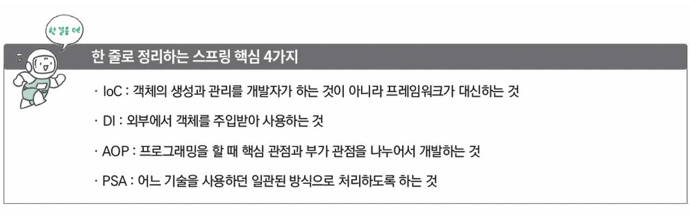

# Spring 4대 개념

 ### 스프링 4대 개념이란,
 객체를 생성·관리하고, 의존성을 주입하며, 공통 기능을 분리하고, 기술 변화에도 일관되게 사용할 수 있도록 해주는 기능이다.

####  객체 관리(IoC), 의존성 주입(DI), 공통 기능 분리(AOP), 기술 추상화(PSA)


<br>
<br>
<br>


## IoC (Inversion of Control)
영어 풀이의 의미 그대로 "제어의 역전" 이라는 뜻으로,  <b>객체의 생성, 관리, 흐름을 개발자가 아닌 외부(프레임워크)</b>가 해주는 관리 시스템이다.

지금까지는 자바 코드를 작성해 객체를 생성할 때는 객체가 필요한 곳에서 직접 생성했지만, Ioc는 <mark>외부에서 관리하는 객체를 가져와 사용</mark>할 수 있다.

ㄴ> 이때 사용되는 외부 (<small>객체를 관리하고 관리하는 주체</small>) 를 스프링 컨테이너라고 한다.

<br>
<br>
<br>


## DI (Dependency Injection)

IoC와 같이 스프링에서는 객체들을 관리하기 위한 기능을 사용한다. 이때 위의 제어의 역전, 즉 Ioc를 구현하기 위해 사용하는 방법이 바로 DI이다. 이때 DI의 영어 풀이 직역은 <mark>의존성 주입</mark>이다.

DI는 한 클래스가 다른 클래스에 의존한다. 

<br>
<br>


ex)
```
public class A {
    // A에서 B 클래스를 주입받는다.
    @Autowired
    B b;
}
```

ㄴ> 이때 사용되는 ``Autowired``는 스프링 컨테이너에 있는 빈을 주입하는 역할을 한다고 한다.

<br>

 _이전에 Autowired를 "객체를 자동으로 넣는 기능이다. 객체를 만드려면 객체를 지정해줘야 하지만, @Autowired 꼴을 사용하면 객체가 자동으로 지정됨" 이라고 정리하였다. 이때 이것이 가능한 이유가 IoC 컨테이너가 객체를 생성·관리하고, DI를 통해 필요한 객체를 자동으로 주입해주기 때문이였다._

<br>
<br>

 ### 빈과 스프링 컨테이너

빈이란 **스프링 컨테이너가 생성하고 관리하는 객체**이다. (<small>@Autowired로 주입받은 B 객체 </small>) 

예를 들어 MyBean이라는 클래스에 @Component을 붙이면 MyBean 클래스가 빈으로 등록되고, 스프링 컨테이너에서 이를 관리한다. 

ㄴ> 이때 빈의 이름이 클래스 이름의 첫 글자를 소문자로 바꾸어 관리한다고 한다.

<br>
<br>
<br>

## AOP (Aspect Oriented Programming)
스프링에서는 <mark>공통적으로 사용되는 기능들을 효율적으로 관리</mark>하기 위한 기능이다. 이때 AOP의 뜻을 직역하면 관점 지향 프로그래밍이 된다.

AOP는 프로그램을 핵심 관점과 부가 관점으로 나누어 관리하는 방식인데, 핵심 관점은 실제 비즈니스 로직 (<small>계좌 이체, 고객 관리 등</small>) 을 의미하고 부가 관점은 데이터베이스 연결 (<small>로그 처리, 보안 등</small>) 과 같이 공통적으로 사용되는 기능을 의미한다.

#### 장점 
-  코드의 중복을 줄일 수 있고, 핵심 로직에 집중할 수 있으며, 유지보수와 확장이 쉬워진다.

<br>
<br>
<br>

## PSA (Portable Service Abstraction)
 PSA를 직역한 뜻은 이식 가능한 서비스 추상화이다. <mark>스프링에서 제공하는 다양한 기술들을 추상화</mark>해 개발자가 쉽게 사용하는 인터페이스를 의미함.

예를 들어, 스프링에서 데이터베이스에 접근하기 위한 기술로는 JPA, MyBatis, JDBC 같은 것이 있다. 이때 여기에서 어떤 기술을 사용하든 일관된 방식으로 데이터베이스에 접근할 수 있도록 인터페이스를 지원하는 것이 PSA라고 한다. 

<br>
<br>
<br>


## 정리
스프링은 <mark>IoC/DI를 통해 객체 간의 의존 관계</mark>를 설정하고, <mark>AOP를 통해 핵심 관점과 부가 로직을 분리해 개발하여 편리성</mark>을 높이며, <mark>PSA를 통해 추상화된 다양한 서비스들을 일관된 방식</mark>으로 사용할 수 있도록 최적화 되어있다. 이를 기반으로 스프링이 만들어졌으며, 이를 스프링 4대 개념이라고 부른다고 한다.

<br>



<br>
<br>
<br>

# 어노테이션 (Annotation)
자바 등 프로그래밍 언어에서 소스 코드에 코드에 대한 정보를 추가하여 <mark>컴파일러나 런타임 환경에 특별한 정보를 전달하는 @ 형태의 표식</mark>이다. 주로 코드 가독성 향상, 자동 코드 생성, Spring의 설정 단순화 등 빌드 시 문법 체크 등에 사용된다.

특징 
- 컴파일러에게 문법 에러를 체크하도록 정보를 제공한다.
- 프로그램을 빌드할 때 코드를 자동으로 생성할 수 있도록 정보를 제공한다.
- 런타임에 특정 기능을 실행하도록 정보를 제공한다.

<br>
<br>
<br>

어노테이션은 크게 세 가지의 종류로 구분된다고 한다. 그 종류로는 자바에서 기본적으로 제공하는 <mark>표준 어노테이션</mark>, 어노테이션을 정의하는 데 사용되는 <mark>메타 어노테이션</mark>, 마지막으로 <mark>사용자 정의 어노테이션</mark>이 있다.

<br>


| 구분           | 누가 만듦    | 역할                       | 예시                                                   |
| ------------ | -------- | ------------------------ | ---------------------------------------------------- |
| 표준 어노테이션     | 자바(Java) | 기본 기능을 표시하고 컴파일러/JVM이 처리 | `@Override`, `@Deprecated`, `@SuppressWarnings`      |
| 메타 어노테이션     | 자바(Java) | 어노테이션을 만들 때 설정하는 용도      | `@Target`, `@Retention`, `@Documented`, `@Inherited` |
| 사용자 정의 어노테이션 | 개발자      | 필요한 기능을 직접 정의            | `@MyAnnotation`, `@Log`, `@Auth`   

ㄴ> 사용자 정의 어노테이션을 만들기 위해선 <mark>@interface가 필요</mark>하다. 

ex)
```
@Target(ElementType.METHOD)
@Retention(RetentionPolicy.RUNTIME)
public @interface MyLog {
}
``` 

<br>
<br>
<br>

``@Component`` 	스프링이 자동으로 객체 만들어서 관리하는 기본 등록 표시 <br>
``@Service``	비즈니스 로직(서비스)이라고 표시하는 클래스 <br>
``@Repository``	DB 관련 처리하는 클래스라고 표시 <br>
``@Controller``	웹 요청(HTML 등) 처리하는 클래스 <br>
``@RestController``	JSON API 응답하는 컨트롤러 (@ResponseBody 포함) <br>
``@Autowired``	필요한 객체를 스프링이 자동으로 넣어줌 (DI) <br>
``@GetMapping``	HTTP GET 요청을 특정 메서드에 연결 <br>
``@PostMapping``	HTTP POST 요청을 특정 메서드에 연결 <br>
``@RequestBody``	JSON 데이터를 자바 객체로 변환해서 받음 <br>
``@Transactional``	DB 작업을 하나로 묶어서 처리 (중간 실패 시 처음으로) <br>

- 여기서 json API란, 데이터를 JSON 형태로 주고받는 웹 통신 방식이다.  
이 때 json이란 key-value 형태를 뜻함.