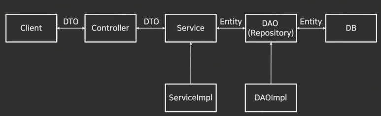

# Spring 게시판 주요기능

- <b>Spring Boot</b>
<br> Spring을 쉽게 쓰게 해주는 프레임워크이다.

<br>

- <b>Spring MVC</b>
<br> 각 부분을 독립적으로 개발하고 변경할 수 있도록 하는 소프트웨어 패턴이다. (Model → Controller → View)

<br>

- <b>JPA (Java Persistence API)</b>
<br> 데이터 베이스와 연결 후 데이터 저장/조회를 쉽게 해준다
<br> <span style="color: gray;">ORM의 자바용 표준 인터페이스이다.</span>

<br>

- <b>Hibernate</b>
<br> JPA의 대표적인 구현체이다.

<br>

- <b>Thymeleaf</b>
<br> HTML 화면 만드는 템플릿 엔진이다.
<br> <span style="color: gray;">ex)</span>
````\<h1>제목\</h1>``` <span style="color: gray;">-></span> ```\<h1 th:text="${title}">\</h1>```

<br>

- <b>MySQL / H2</b>
<br> 데이터베이스에서 사용하는 언어이다.

<br>
<br>
<br>
<br>

# Entity, Controller, Service, Repository, Dto



스트링 부트의 기본 구조이다. <span style="color: gray;"><small>출처 https://hoyeong-rithm.tistory.com/103</small></span>

<br>

- ### <b>Controller</b>

    컨트롤러는 클라이언트로부터 <mark>요청을 받고</mark> 해당 요청에 대해 서비스 레이어에 구현된 적절한 <mark>메소드를 호출해서 결과</mark>를 받는다. 클라이언트의 HTTP 요청을 받아서 처리하고, 그에 따른 결과를 HTTP로 반환한다.

    - **@RestController**

        Json 형태로 객체 데이터를 반환한다
        <br><span style="color: gray;">JSON = 데이터를 주고받기 위한 key-value
        <br> ex)</span>

```json
        {
          "name": "민수",
          "age": 20
        }
```

    - <b>@RequestMapping</b>

        요청 경로와 해당 요청을 처리하는 메소드를 매핑할 때 사용한다.

    - <b>@Autowired</b>

        객체를 자동으로 넣는 기능이다.
        <br><span style="color: gray;">객체를 만드려면 객체를 지정해줘야 하지만, @Autowired 꼴을 사용하면 객체가 자동으로 지정됨</span>

    - <b>@(사용 이름)Mapping</b>

        각각 HTTP의 GET, POST, PATCH, PUT, DELETE 요청을 처리하는데 사용된다.

    - <b>@RequestBody</b>

        HTTP의 Body 내용을 지정된 객체에 매핑하는 역할을 한다. 이를 통해 클라이언트가 전달한 Json 데이터를 추출하고 처리할 수 있다.

<br>
<br>

- ### <b>Entity</b>

    Spring Data JPA를 사용하면 <mark>데이터베이스에 테이블을 생성하기 위해 직접 쿼리를 작성할 필요 없이 자동으로 작성</mark>된다. 이때, 이를 가능하게 하는 기능이 엔티티이다.

    JPA에서 엔티티는 데이터베이스로 따지면 테이블과 역할이 같으며, 데이터베이스에 쓰일 테이블과 생성하고 정의한다.

    - <b>@Entity</b>

        해당 클래스가 엔티티임을 명시한다.

    - <b>@Table</b>

        클래스의 이름과 테이블의 이름을 다르게 지정해야 하는 경우에 사용한다.
        <br><span style="color: gray;">@Table을 명시하지 않으면 테이블의 이름과 클래스의 이름이 동일하다는 의미</span>

    - <b>@Id</b>

        @Id가 선언된 필드는 테이블의 기본값 역할로 사용된다.
        <br><mark>모든 엔티티는 @Id 작성 필수</mark>

    - <b>@GeneratedValue</b>

        @Id와 함께 사용되며, 해당 필드의 값을 어떤 방식으로 자동으로 생성할지 결정할 때 사용한다.

        > **Auto** : @GeneratedValue의 기본 설정 값. 기본값을 사용하는 데이터베이스에 맞게 자동 생성된다.
        >
        > **IDENTITY** : 기본값 생성을 데이터베이스에 위임하는 방식이다.

    - <b>@Column</b>

        필드에 설정을 더할 때 사용한다.

        > **name** : 데이터베이스의 칼럼명을 설정한다. 명시하지 않으면 필드명으로 저장됨
        >
        > **nullable** : 레코드를 생성할 때 칼럼 값에 null 처리가 가능한지를 명시한다
        >
        > **length** : 데이터베이스에 저장하는 데이터의 최대 길이를 설정한다
        >
        > **unique** : 해당 칼럼을 유니크로 설정한다 (unique란, 같은 값이 두 번 들어가면 안 되게 만드는 설정)

<br>
<br>

- ### <b>Repository</b>

    엔티티 매니저를 사용해 엔티티를 저장하고 데이터베이스를 조회한다. 코드를 쓸 때 JpaRepository를 상속받으면 별도의 메소드 구현 없이도 많은 기능을 제공 받을 수 있다.

    <span style="color: gray;">ex)</span>

```java
    public interface ProductRepository extends JpaRepository<Product, Long> {
    }
```

<br>
<br>

- ### <b>DTO (Data Transfer Object)</b>

    각 클래스 및 인터페이스를 호출하면서 전달하는 매개변수 데이터 객체이다.

    <span style="color: gray;">DTO는 데이터를 교환하는 용도로만 사용하는 객체이기 때문에 별도의 로직이 포함되지 않고, 주로 Getter, Setter 메소드만을 갖는다.</span>

<br>
<br>

- ### <b>Service</b>

    서비스 계층에는 비즈니스 로직이 있고 핵심 기능을 처리한다.

    <span style="color: gray;">서비스의 인터페이스에서는 DAO에서 구현한 기능을 호출해서 결과값을 가져오는 작업을 수행하며, <strong>클라이언트가 요청한 데이터를</strong> 적절하게 가공해서 <strong>컨트롤러에게 전달</strong>한다.</span>

<br>
<br>
<br>
<br>

# 부 개념

### ORM (Object-Relational Mapping)

객체와 관계형 DB 사이의 객체를 통해 DB 테이블을 조작할 수 있게 해준다.

<br>

> ### 사용 이유

일반적으로 자바 프로그램에서는 데이터를 객체로 다루고, DB 테이블과 SQL을 사용해 데이터를 관리한다. 하지만 이 과정에서 간극이 일어나는데, 이때 이 간극을 매꿔주는 것이 ORM이다.

ORM은 자바 객체와 DB 테이블을 연결해주고, 객체를 조작하면 알아서 SQL로 변환해 DB에 반영해준다.

> ### 장점

SQL을 직접 작성할 필요 없이, 객체를 통해 DB 작업을 할 수 있음

객체 지향적 코딩으로 유지보수가 쉬움

특정 DB에 종속되지 않아, 코드 변경 없이도 다양한 DBMS로 전환이 가능

<br>
<br>
<br>
<br>

## JPA (Java Persistence API)

> ### 핵심 기능

- <b>영속성 컨텍스트 (Persistence Context)</b>

    JPA에서 엔티티 객체를 관리하는 저장소이다.

- <b>변경 감지 (Dirty Checking)</b>

    엔티티의 변경 사항을 감지해 DB에 자동 반영한다.
    <br><span style="color: gray;">객체의 값을 수정하고 별도의 SQL을 작성 필요 X</span>

- <b>지연 로딩 (Lazy Loading)과 즉시 로딩 (Eager Loading)</b>

    연관된 엔티티를 언제 로드할지 결정한다.
    <br><span style="color: gray;">기본적으로 지연 로딩(LAZY)을 사용해 필요할 때만 데이터를 불러오는 것이 성능에 유리</span>

- <b>JPQL (Java Persistence Query Language)</b>

    JPA는 SQL 대신 JPQL이라는 객체 지향 쿼리 언어를 사용한다.
    테이블이 아닌 객체를 대상으로 쿼리를 작성할 수 있어 객체 지향적 개발이 가능함.
    <br><span style="color: gray;">코드 → JPQL → SQL → DB의 과정을 거침</span>

<br>
<br>
<br>
<br>

## CRUD (create read update delete)

CRUD란, 데이터 다루는 행동의 패턴 이름이다.

Create → 만들기
<br>Read → 읽기
<br>Update → 수정
<br>Delete → 삭제

<br>

> ### 데이터 베이스의 CRUD

- <b>SQL (DB)</b>
    - INSERT (Create)
    - SELECT (Read)
    - UPDATE (Update)
    - DELETE (Delete)

<br>
<br>
<br>
<br>

## MySQL, H2 Database

> ### MySQL
- 가장 널리 사용되는 데이터베이스 관리 시스템이다.
- 데이터를 파일이 아니라 서버에 저장한다.
- 속도가 빠르고 안정적이다.

> ### H2
- 자바로 작성된 관계형 데이터베이스 관리 시스템이다.
- 메모리에 저장된다. (껐다 키면 날아감)
- 테스트용으로 용이

<br>

| 구분 | MySQL | H2 |
|------|-------|----|
| 용도 | 실제 서비스 | 개발/테스트 |
| 저장 | 서버 | 메모리 |
| 데이터 유지 | O | X |
````
