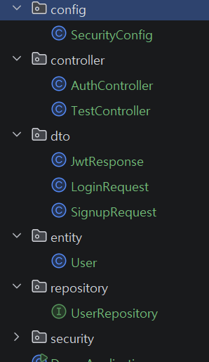

# 목표
### 인증, 인가 구현하기

1. 프로젝트 생성
2. Entity
3. 회원가입
4. 로그인
5. JWT 생성
6. JWT 검증
7. JWT 필터
8. Security 설정
9. 권한 처리

<hr>

### 1. 의존성 추가
기능을 사용하기 위해 이미 만들어진 기능 또는 본인이 구현한 기능을 가져오기 위해 의존성을 추가한다.

```
package com.example.demo.config;

// 사용자 정보 조회 서비스
import com.example.demo.security.CustomUserDetailsService;

// JWT 검증 필터
import com.example.demo.security.JwtAuthenticationFilter;

// JWT 생성/검증 클래스
import com.example.demo.security.JwtTokenProvider;

// 생성자 자동 생성
import lombok.RequiredArgsConstructor;

// 스프링 Bean 등록용 설정 클래스
import org.springframework.context.annotation.Bean;

// 설정 클래스 선언
import org.springframework.context.annotation.Configuration;

// 인증 매니저
import org.springframework.security.authentication.AuthenticationManager;

// AuthenticationManager 꺼내오기용
import org.springframework.security.config.annotation.authentication.configuration.AuthenticationConfiguration;

// Security 설정용 객체
import org.springframework.security.config.annotation.web.builders.HttpSecurity;

// Spring Security 활성화
import org.springframework.security.config.annotation.web.configuration.EnableWebSecurity;

// csrf disable 같은 설정용
import org.springframework.security.config.annotation.web.configurers.AbstractHttpConfigurer;

// 세션 정책 설정용
import org.springframework.security.config.http.SessionCreationPolicy;

// 비밀번호 암호화
import org.springframework.security.crypto.bcrypt.BCryptPasswordEncoder;

// 비밀번호 암호화 인터페이스
import org.springframework.security.crypto.password.PasswordEncoder;

// 최신 Security 설정 방식
import org.springframework.security.web.SecurityFilterChain;

// JWT 필터 위치 지정용
import org.springframework.security.web.authentication.UsernamePasswordAuthenticationFilter;

// CORS 설정
import org.springframework.web.cors.CorsConfiguration;

// CORS 설정 source
import org.springframework.web.cors.CorsConfigurationSource;

// URL 기반 CORS 설정
import org.springframework.web.cors.UrlBasedCorsConfigurationSource;

// 리스트 사용
import java.util.List; 
```

<br>
<hr>

### 2. entity 등 필요한 파일들을 생성한다.
<br>



### config
- 프로젝트 보안/설정 관리

    - #### SecurityConfig
        - Spring Security 및 JWT 설정


### controller
- API 요청 처리

    - #### AuthController
        - 로그인 / 회원가입 요청 처리

    - #### TestController
        - 테스트용 API 확인


### dto
- 요청/응답 데이터 전달 객체

    - #### LoginRequest
        - 로그인 요청 데이터 저장

    - #### SignupRequest
        - 회원가입 요청 데이터 저장

    - #### JwtResponse
        - JWT 토큰 응답 데이터 저장


### entity
- DB 테이블 객체 관리

    - #### User
        - 사용자 정보 저장 Entity


### repository
- DB 접근 담당

    - #### UserRepository
        - 사용자 조회 및 저장


### security
- JWT 및 인증 처리

    - #### JwtAuthenticationFilter
        - 요청마다 JWT 검사

    - #### JwtTokenProvider
        - JWT 생성 및 검증

    - #### CustomUserDetailsService
        - 사용자 인증 정보 조회

<hr>

### 3. 확인하기

구현한 인증/인가가 제대로 동작하는지 Postman으로 확인

---

#### 사전 준비

IntelliJ에서 ".\gradlew bootRun"을 터미널에 입력

#### 1. 회원가입 확인

```json
{
  "username": "hong",
  "password": "1234"
}
```
을 포스트맨에 넣어 send로 실행한다.

```json
{ "message": "회원가입 성공!" }
```
실행에 성공하면 해당 문구가 나오게 된다. (실패 시 403)

---

#### 2. 로그인

가입한 계정으로 로그인하면 JWT 토큰을 받아 저장한다.

- **URL:** `http://localhost:8080/auth/login`  

로그인 정보를 넣고 send로 실행한다.

```json
{
  "token": "eyJhbG...",
  "username": "hong"
}
```
실행에 성공하면 위의 문구가 나온다.

이때, 응답에서 `token` 값을 복사 후 요청에서 계속 쓴다고 한다.

---

#### 3. 인증 확인 (토큰 있을 때)

토큰을 헤더에 담아서 요청하여 로그인이 가능하다.

- **Method:** GET  
- **URL:** `http://localhost:8080/api/me`  
- **Headers:**

```json
{
  "username": "hong",
  "role": "[ROLE_USER]"
}
```
성공 시 해당 문구가 나온다.

---

#### 4. 인가 확인 (토큰 없을 때)

로그인이 불가능하다.

- **Method:** GET  
- **URL:** `http://localhost:8080/api/me`  
- **응답:** `403 Forbidden`

토큰 없이는 접근이 안 된다는 걸 여기서 확인한다.

---

#### 5. 비밀번호 틀렸을 때

로그인 시 비밀번호를 잘못 입력하면 어떻게 되는지 확인한다.

- **Method:** POST  
- **URL:** `http://localhost:8080/auth/login`  
- **Body (JSON):**
```json
{
  "username": "hong",
  "password": "틀린비밀번호"
}
```
이 역시도 토큰이 일치하지 않으니 401 오류가 뜨게 된다.


#### 요약

| 테스트 항목 | 결과 |
|---|---|
| 회원가입 | 200 + 성공 메시지 |
| 로그인 성공 | 200 + JWT 토큰 |
| 비밀번호 틀림 | 401 |
| 토큰 O 요청 | 200 + 내 정보 |
| 토큰 X 요청 | 403 |


#### Postman란?
- 프론트엔드 없이도 백엔드 기능을 확인할 수 있음
- 벡엔드 API 요청과 응답을 테스트 할 수 있게 해주는 프로그램

